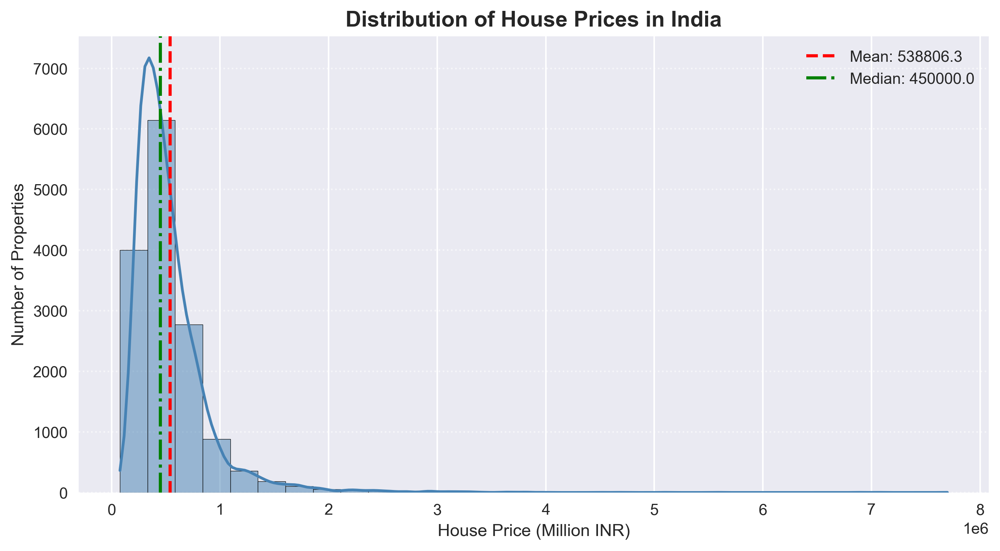
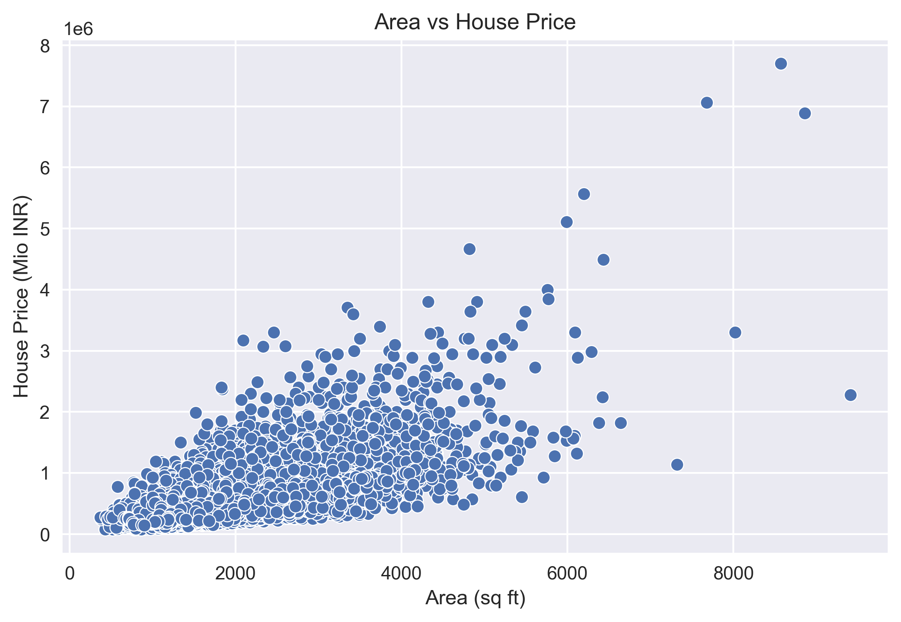
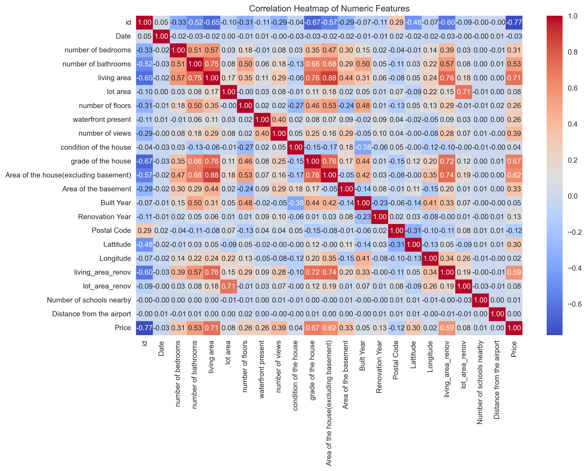
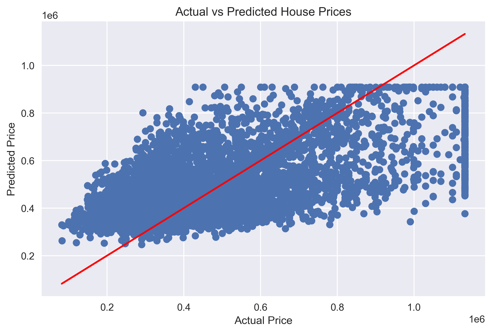
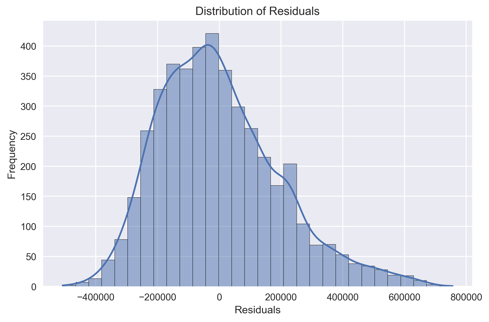

# 🏠 House Price Prediction – India
### Linear Regression | End-to-End ML Project with Web App

## 📌 Project Overview
This project builds an end-to-end Machine Learning pipeline to predict house prices in India using Linear Regression. It demonstrates the complete ML workflow — from data analysis and visualization to model building, evaluation, and deployment through a simple web app.

The goal of this project is not just prediction, but understanding the data, validating assumptions, and interpreting results in a business context.

---

## 🎯 Business Objective
To develop a baseline house price estimation model that:

- Predicts house prices based on property area
- Helps understand how strongly area influences pricing
- Provides a foundation for more advanced real-estate valuation models

---

## 🌐 Web Application
A simple HTML-based web interface allows users to enter the house area and get a predicted price instantly.
This demonstrates how a trained ML model can be connected to a front-end for real-world usage. 

User Input: Area (sq. ft)  
Output: Predicted house price

---

## 📂 Project Structure
House-Price-Prediction-India/ 
│ 
├── data/ 
│   └── House Price India.csv 
│ 
├── house_price_app/ 
│   └── templates/ 
│       ├── index.html 
│   └── venv/ 
│   ├── app.py 
│   ├── house_price_model.pkl 
│   ├── requirements.txt 
│ 
├── images/ 
│   ├── price_distribution.png 
│   ├── area_vs_price.png 
│   ├── correlation_heatmap.png 
│   ├── actual_vs_predicted_prices.png 
│   └── residual_distribution.png 
│ 
├── notebook/ 
│   └── linear_regression_house_prices_india.ipynb 
│ 
├── video/ 
│   └── house_price_indicator_webapp.mp4 
│ 
└── README.md 

---

## 📊 Exploratory Data Analysis (EDA)

### 🔹 Price Distribution

  

**Insight:**  
House prices show a right-skewed distribution, indicating the presence of premium properties that influence the average price.

---

### 🔹 Area vs Price Relationship

  

**Insight:**  
There is a strong positive relationship between property area and price, making the dataset suitable for Linear Regression.

---

### 🔹 Correlation Heatmap

  

**Insight:**  
Numeric features show varying degrees of correlation with house prices, supporting informed feature selection.

---

## 🧹 Data Preprocessing
Key preprocessing steps include:
- Capping outliers using the IQR method
- Feature scaling
- Train–test split

Ensures stable, unbiased, and reliable model performance.

---

## 🤖 Model Training – Linear Regression
A Linear Regression model was trained using **property area** as the independent variable.

### 🔹 Actual vs Predicted Prices

  

**Insight:**  
Predictions closely follow actual values for mid-range properties, indicating a good baseline fit.

---

## 📈 Model Evaluation & Diagnostics

### 🔹 Residual Distribution

  

**Insight:**  
Residuals are centered around zero with near-normal distribution, suggesting minimal bias and acceptable model assumptions.

---

## 📏 Performance Metrics
- **MAE:** Average absolute prediction error  
- **RMSE:** Penalizes larger errors  
- **R² Score:** Measures explanatory power of the model  

These metrics indicate the model performs reasonably well as a **baseline estimator**.

---

## 🧠 Key Learnings
- Area of the house is a strong driver of house prices
- Linear Regression provides interpretability and transparency
- Outlier handling significantly improves model stability
- Residual analysis is critical before real-world deployment

---

## 🛠️ Tools & Technologies
- **Python**
- **pandas, numpy**
- **matplotlib, seaborn**
- **scikit-learn**
- **Jupyter Notebook**
- **HTML (for web interface)**

---

## 👤 Author
**Sitaram Dalvi**  
AI / ML Enthusiast | Project Management Professional  

---

## 🤝 Acknowledgment
This project was built as a hands-on learning exercise.  
ChatGPT was used as a support tool for understanding concepts, improving code structure, debugging, and refining documentation.  

