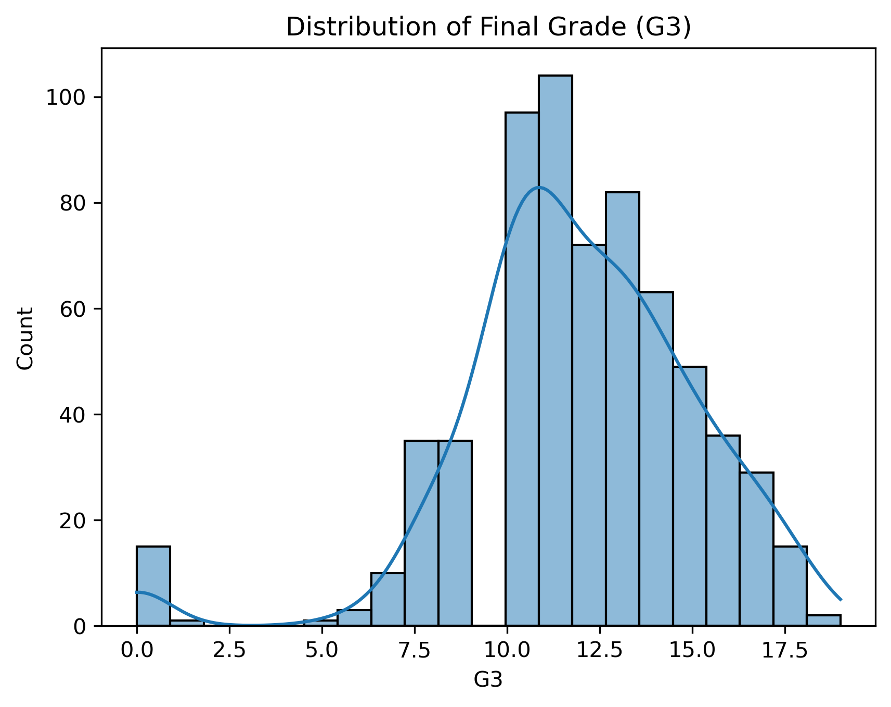
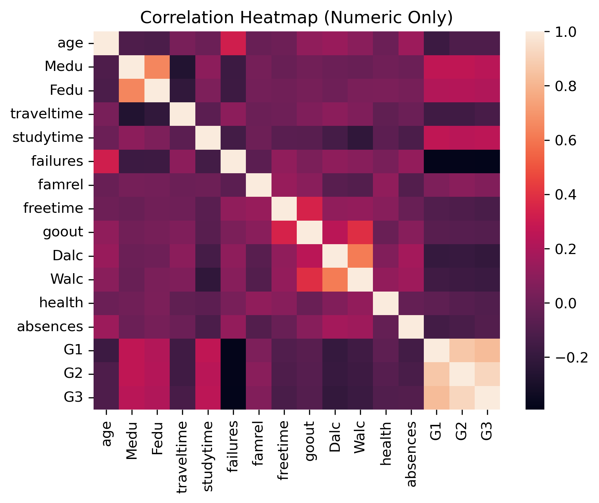

## 🎓 Student Final Grade Prediction (Linear & Ridge Regression)
### Linear Regression vs Ridge Regression (Regularization Project)

An end-to-end Machine Learning project that predicts a student’s final academic performance (G3 grade) using academic history, family background, and lifestyle attributes.  

This project demonstrates an important ML concept: How regularization (Ridge Regression) improves a Linear Regression model.

---

### 📌 Problem statement

Educators often identify weak students too late, after final exams.  
If we can predict final grades earlier, teachers can intervene and support struggling students.  

This project answers: Can we estimate a student’s final performance before the final exam using data?

---

### 🎯 Objective

- Predict student final grade (G3)
- Understand key performance drivers
- Compare Linear Regression vs Ridge Regression
- Study the effect of overfitting & regularization

---

### 📊 Dataset

Student Performance Dataset (Portuguese secondary school students)  

Features include:  
|Category|Examples|
|-|-|
|Academic|G1, G2 (previous grades), study time, failures|
|Family|Parent education (Medu, Fedu), family relationship|
|Lifestyle|going out, alcohol use, free time|
|Personal|age, absences, health|

Target Variable: G3 (Final Grade)

---

### 📂 Project Structure

04_linear_and_ridge_regression_student_performance/  
│  
|── data/  
│   ├── student-por.csv  
|  
├── images/  
│   ├── finalgradeG3_distribution.png  
│   ├── correlation_heatmap.png  
│   ├── actual_vs_predicted_ridge_reg.png  
│  
├── linear_regression_ridge_student_performance  
|  
└── README.md  

### 📊 Exploratory Data Analysis (EDA)

#### 🔹 Final Grade Distribution

  

- Most students score between 10 and 15, with very few extremes.
- Some zero scores indicate performance failures.

#### 🔹 Correlation Heatmap

  

- G1 & G2 strongly predict G3
- Past failures reduce final grades
- Lifestyle effects are minor
- Absences have weak negative correlation
- ➡️ Academic history is the strongest driver

### 🤖 Model Training

Two models were developed:

- 1️⃣ Linear Regression
    - Baseline predictive model
    - Simple & interpretable

- 2️⃣ Ridge Regression
    - Adds L2 regularization to:  
        ✔ reduce overfitting  
        ✔ stabilize coefficients  

### 📏 Model Performance
| Model              |   MSE   |   R²    |
|--------------------|--------:|--------:|
| Linear Regression  | 1.4758  | 0.8487  |
| Ridge Regression   | 1.4741  | 0.8488  |

✔ Ridge Regression slightly reduced MSE  
✔ Both models explain ~84.9% of grade variation  
✔ Improvement is small but positive  

### 🧠 Key insights and learning summary

Initial model using linear regression and improvement using ridge regression
- Linear Regression already performs strongly
- Ridge Regression improves stability
- Error reduction = 0.0017 MSE
- R² improvement = 0.0001
- ➡️ Dataset shows low overfitting — hence small gains

### Overall learning outcome

- Early-term grades (G1 & G2) are the strongest success indicators
- Academic patterns matter more than lifestyle variables
- Regularization helps model robustness
- Predictive modeling can flag struggling students earlier

### Conclusion

- Both Linear & Ridge Regression perform reliably
- Ridge slightly improves generalization
- Results support early-intervention strategies
- Schools can use such models to:
    - Monitor student progress
    - Identify risk trends
    - Guide academic support planning
- This project highlights machine learning applied responsibly in education analytics.

### 🛠️ Tools & Technologies

- Python
- pandas, numpy
- matplotlib, seaborn
- scikit-learn
- Jupyter Notebook

### 👤 Author

Sitaram Dalvi  
AI / ML Enthusiast | Project Management Professional  

### ⭐ Why This Project Matters

This project blends:
- Data storytelling
- Predictive modeling
- Real-world interpretability

…demonstrating how analytics can support student success outcomes through informed academic insight.