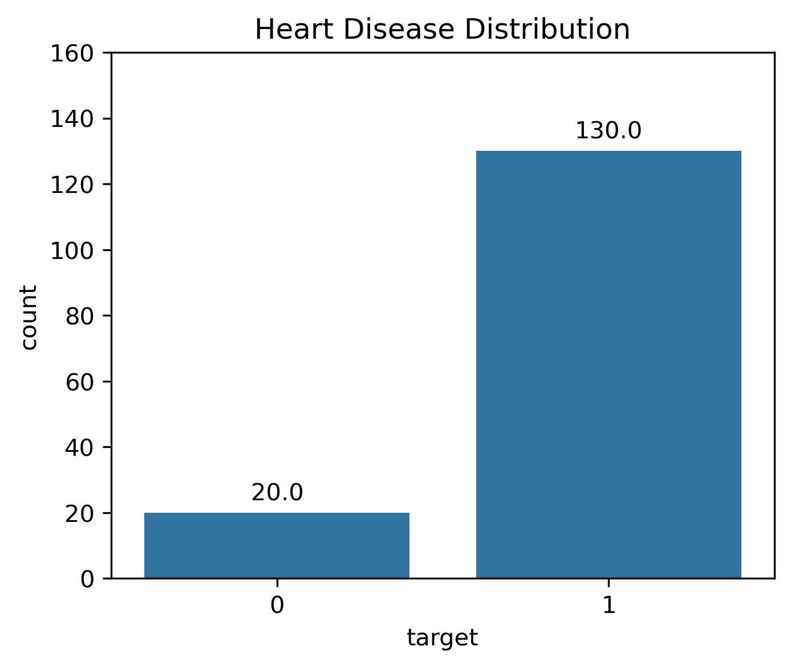
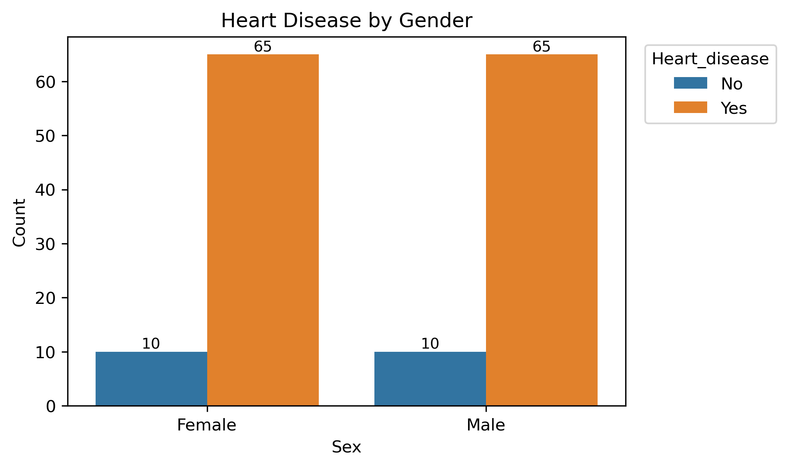
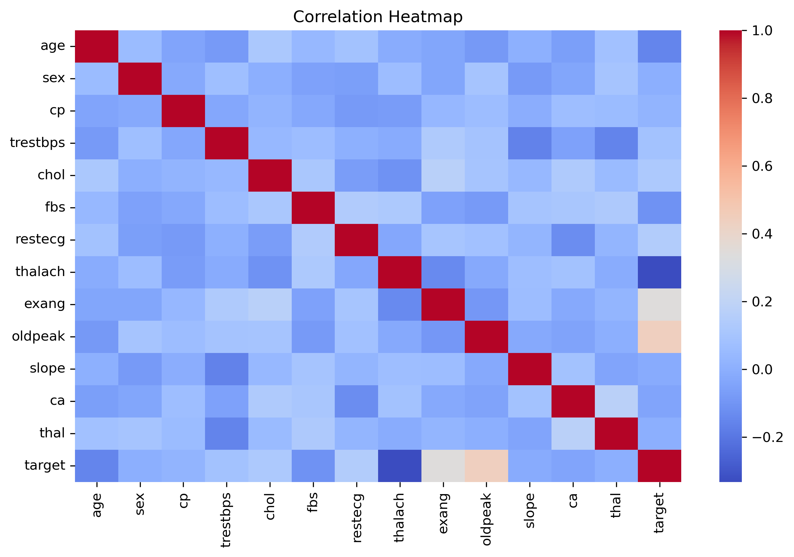
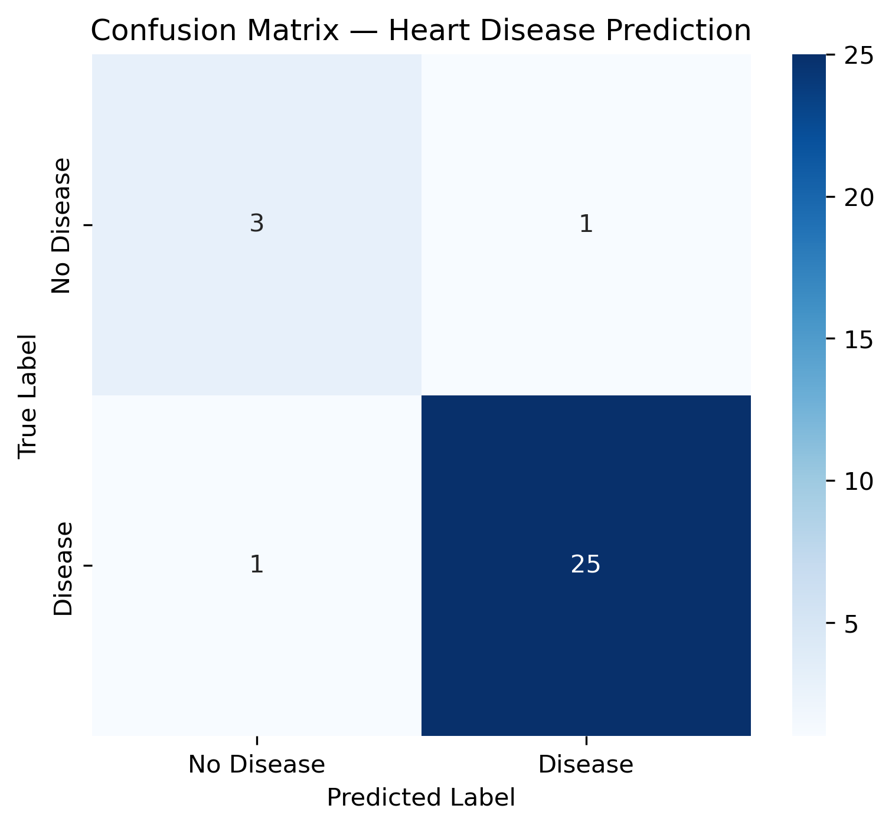
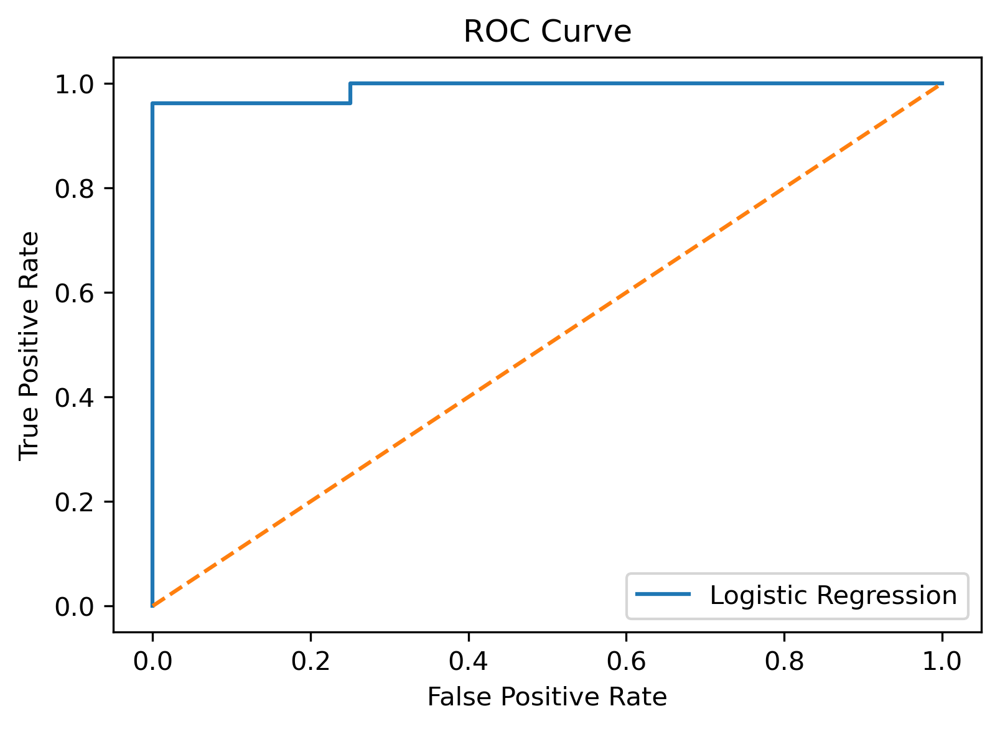

# ❤️ Heart Disease Risk Prediction
### Logistic Regression Classification Project (Healthcare Analytics)

An end-to-end Machine Learning project that predicts whether a patient is at risk of heart disease using clinical and lifestyle health indicators.  

This project demonstrates a core Data Science skill:  
Building an interpretable classification model and evaluating it using medical-grade metrics (Confusion Matrix, Precision, Recall, ROC-AUC).

---

### 📌 Problem statement

Heart disease is one of the leading causes of death worldwide. Doctors often detect risk after symptoms become severe.  

If we can predict risk early using patient data, preventive care can begin sooner.  

This project answers: Can we identify high-risk patients using routine medical measurements?  

---

### 🎯 Objective

- Classify patients into:
  - 0 → No Heart Disease
  - 1 → Heart Disease Risk
- Understand important medical risk factors
- Evaluate classification model properly
- Demonstrate Logistic Regression in a real healthcare scenario

⚠️ This is a decision-support model, not a medical diagnosis tool.

---

### 📊 Dataset

The dataset contains patient medical attributes collected during clinical evaluation.  

|Key |Features|
|-|-|
|Category	|Variables|
|Personal	|age, sex|
|Symptoms	|chest pain type (cp), exercise-induced angina (exang)|
|Vitals	|resting blood pressure (trestbps), cholesterol (chol)|
|Cardiac Tests	|max heart rate (thalach), ST depression (oldpeak), ECG results (restecg)|
|Other	|fasting blood sugar (fbs), thalassemia (thal), number of vessels (ca)|

Target Variable: target  
(1 = heart disease risk)

---

### 📂 Project Structure

03_logistic_regression_heart_disease_risk/  
│  
|── data/  
│   ├── heart_disease_risk.csv  
│  
├── images/  
│   ├── heart_disease_distribution.png  
│   ├── age_distribution.png  
│   ├── gender_vs_heart_disease.png  
│   ├── correlation_heatmap.png  
│   ├── confusion_matrix.png  
│   ├── ROC_curve.png 
│   ├── feature_importance.png   
│  
├── logistic_regression_heart_disease_risk.ipynb  
│  
└── README.md  

---

### 📊 Exploratory Data Analysis (EDA)

#### 🔹 Heart Disease Distribution  

  

- Majority of samples show **presence of heart disease**
- Indicates a slightly imbalanced dataset

#### 🔹 Gender vs Heart Disease  

  

- Similar risk across genders in this dataset

#### 🔹 Correlation Heatmap  

  

- Strongest associations were found with  
  ✔ chest pain type  
  ✔ ST-depression (oldpeak)  
  ✔ max heart rate achieved  
  ✔ exercise-induced angina  

---

### 🤖 Model Training

A **Logistic Regression model** was trained to classify:

- 0 = No Heart Disease  
- 1 = Heart Disease Present  

Steps included:

✔ Feature preprocessing  
✔ Train-test split  
✔ Standardization  
✔ Model fitting  
✔ Probability prediction  

---

### 📏 Model Performance

#### Performance metrics
| Metric | Score |
|--------|------:|
| Accuracy | 0.93 |
| Precision (Heart Disease) | 0.96 |
| Recall (Heart Disease) | 0.96 |
| AUC Score | 0.99 |

✔ High recall means **high-risk patients are rarely missed**  
✔ ROC curve close to top-left indicates **excellent separability**

#### Confusion matrix

  

Insights:
- Very few false negatives
- Most high-risk patients correctly detected  

This is important because: In healthcare, missing a sick patient (False Negative) is worse than a false alarm.  

#### ROC curve

  

Insights:  
ROC curve close to top-left corner → excellent class separation.  
AUC ≈ 0.99  
Indicates extremely strong predictive capability.  

---

### 🧠 Key insights and learning summary

Initial model using Logistic Regression

- Logistic Regression predicts risk **with very high accuracy**
- Class imbalance handled effectively
- Most misclassifications occur in “no disease” class
- AUC ~0.99 indicates **near-perfect discrimination ability**
- Model remains **interpretable and clinically meaningful**

---

### Overall learning outcome

- **Chest pain type, max heart rate, ST-depression, and exercise response** are the strongest predictors  
- **Age meaningfully increases risk**
- **Gender impact is minimal in this dataset**
- Features show **low-to-moderate correlation**, reducing multicollinearity concerns
- Logistic models provide **transparent, explainable medical insights**

---

### Conclusion

- Logistic Regression delivers **strong predictive performance**
- Model supports:
  - Early-risk identification
  - Patient health monitoring
  - Doctor decision-support systems  

This project shows how **machine learning can enhance preventive cardiology and patient-care planning**.

---

### 🛠️ Tools & Technologies

- Python  
- pandas, numpy  
- matplotlib, seaborn  
- scikit-learn  
- Jupyter Notebook  

---

### 👤 Author

Sitaram Dalvi  
AI / ML Enthusiast | Project Management Professional  

---

### ⭐ Why This Project Matters

This project blends:

- Medical analytics  
- Predictive modeling  
- Risk assessment  
- Real-world decision support  

…showing how data science can help reduce **heart-disease risk through early detection & prevention**.
