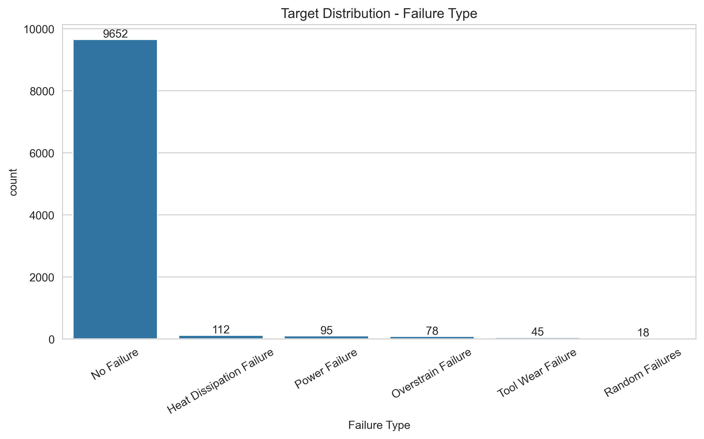
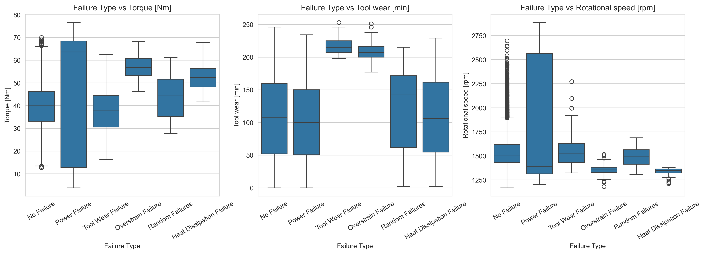
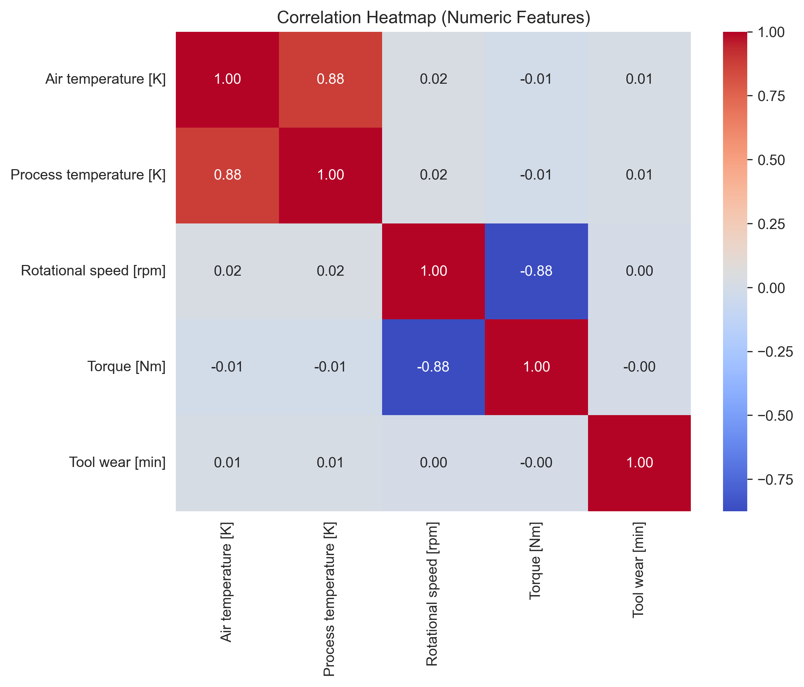
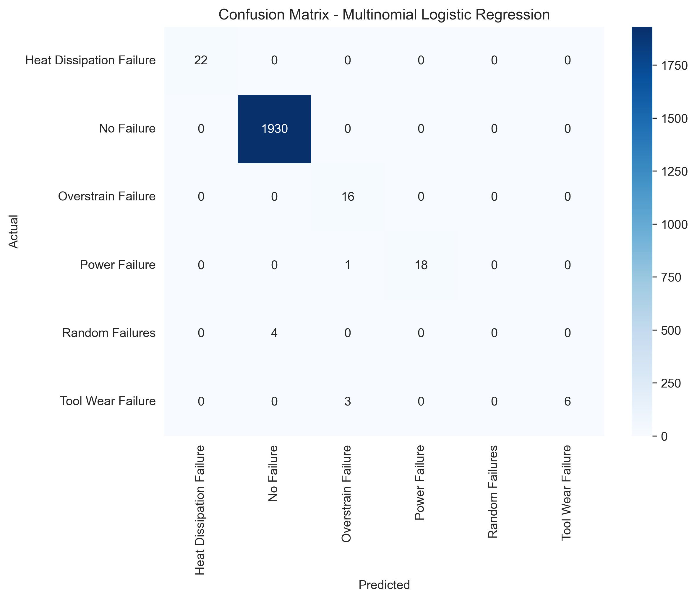
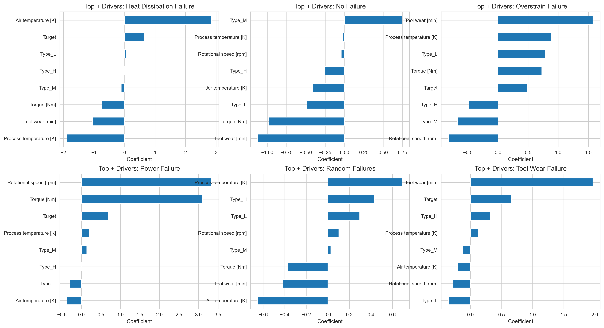

# 🏭 Predictive Maintenance – Machine Failure Type Prediction
### Multiclass Classification using Multinomial Logistic Regression

An end-to-end Machine Learning project that predicts which type of machine failure will occur using sensor readings and operating conditions.  

This project demonstrates a real industrial ML application: Using machine sensor data to detect failures before breakdown happens.  

### 📌 Problem statement

In manufacturing plants, machines often fail unexpectedly.  
Unplanned downtime leads to:  
- Production loss
- Expensive repairs
- Delivery delays
- Safety risks
- Traditional maintenance is reactive (repair after failure).  

The goal of this project: Predict the failure type early so maintenance can be scheduled before the machine stops.  

---

### 🎯 Objective

- Classify machine condition into failure types
- Identify key operational drivers of failures
- Build an interpretable predictive maintenance model
- Demonstrate multiclass classification in a real industrial dataset

---

### 📂 Dataset

Machine sensor and operating data collected from industrial equipment.  

Input Features  
|Feature	|Description|
|Air temperature	|surrounding environment temperature|
|Process temperature	|machine operating temperature|
|Rotational speed (rpm)	|shaft speed|
|Torque (Nm)	|load on machine|
|Tool wear (min)	|usage duration of tool|
|Machine Type	|L / M / H category machines|

Target (Failure Type):  
- No Failure
- Heat Dissipation Failure
- Overstrain Failure
- Power Failure
- Tool Wear Failure
- Random Failures

---

### 📂 Project Structure

04_multinomial_logistic_regression_predictive_maintenance/  
│  
|── data/  
│   ├── predictive_maintenance.csv  
│  
├── images/  
│   ├── target_distribution_failure_type.png  
│   ├── numeric_features_distribution.png  
│   ├── failure_types_vs_numeric_features.png  
│   ├── correlation_heatmap.png  
│   ├── confusion_matrix.png  
│   ├── features_coefficient.png  
│  
├── logistic_regression_machine_predictive_maintenance.ipynb  
│  
└── README.md  

---

### 📊 Exploratory Data Analysis (EDA)

#### 🔹 Failure Type Distribution  

  

- Dataset is **highly imbalanced**
- Majority class is **No Failure**
- Minority failure types have very low count → impacts recall

#### 🔹 Failure Type vs Torque / Tool Wear / RPM (Boxplots)

  

- Different failure types show different behavior patterns across:  
  ✔ Torque  
  ✔ Rotational speed  
  ✔ Tool wear  
- Helps understand which operational conditions push machines toward failure

#### 🔹 Correlation Heatmap  

  

Key relationships observed:
- **Air temperature ↔ Process temperature** show strong positive correlation  
- **RPM ↔ Torque** show strong negative correlation  
- **Tool wear** shows near-zero correlation with other features (independent driver)

---

### 🧪 Data Preparation

Steps included:

✔ Dropping irrelevant identifier columns (UDI, Product ID)  
✔ Separating **Failure Type** as the multiclass target  
✔ Train-test split with stratification  
✔ Preprocessing pipeline:
- Standard scaling for numeric features
- One-hot encoding for categorical features (Type)

---

### 🤖 Model Training

A **Multinomial Logistic Regression model** was trained to classify:

- Heat Dissipation Failure  
- No Failure  
- Overstrain Failure  
- Power Failure  
- Random Failures  
- Tool Wear Failure  

Training included:

✔ Pipeline preprocessing  
✔ Softmax-based multinomial classification  
✔ Model fitting & predictions

---

### 📏 Model Performance

#### Performance metrics
| Metric | Score |
|--------|------:|
| Accuracy | 1.00 |
| Weighted F1-score | 0.99 |
| Macro F1-score | 0.78 |

✅ Weighted score is high mainly because **No Failure dominates the dataset**  
⚠ Macro score drops due to poor performance on rare failure classes  

#### Confusion matrix

  

Insights:
- Strong predictions for “No Failure”
- Some Tool Wear misclassified
- Random failures hardest to predict (very few samples)  

This is expected in real maintenance datasets.

---

### 📌 Feature Interpretation (Top Drivers)

  

This project extracts **top feature drivers per failure type** using Logistic Regression coefficients.

Key learnings:
- **Torque, RPM, and Tool Wear** act as major contributors for different failures
- Coefficients provide clear direction:
  - Higher coefficient → increases probability of that failure type
  - Lower coefficient → reduces probability of that failure type

This makes the model highly **interpretable and explainable** for industrial use-cases.

---

### 🧠 Key insights and learning summary

Multinomial Logistic Regression for predictive maintenance provides:

- Highly interpretable multiclass classification
- Strong overall accuracy
- Clear operational drivers for each failure type
- Evidence of class imbalance impact on rare failures

➡ Model performs extremely well for majority failure patterns, but rare failures need enhancement.

---

### ✅ Key business takeaway

Early prediction of machine failure types enables:

- **Condition-based maintenance** instead of reactive repair  
- Reduced **production downtime**
- Lower **equipment damage risk**
- Improved **resource planning** (spare parts & technician scheduling)

By monitoring key operational drivers (Torque, RPM, Tool wear), organizations can prevent breakdowns and optimize maintenance efficiency.

---

### 🛠️ Tools & Technologies

- Python  
- pandas, numpy  
- matplotlib, seaborn  
- scikit-learn  
- Jupyter Notebook  

---

### 👤 Author

Sitaram Dalvi  
AI / ML Enthusiast | Project Management Professional  

---

### ⭐ Why This Project Matters

This project combines:

- Predictive analytics  
- Multiclass classification  
- Explainable machine learning  
- Real-world industrial decision support  

…showing how machine learning can reduce equipment failure risk through **early detection and smarter preventive maintenance**.
