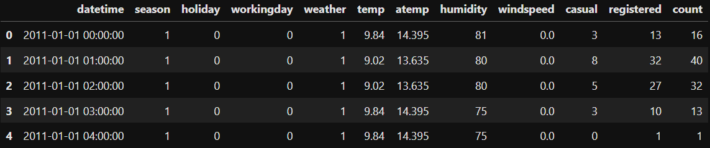
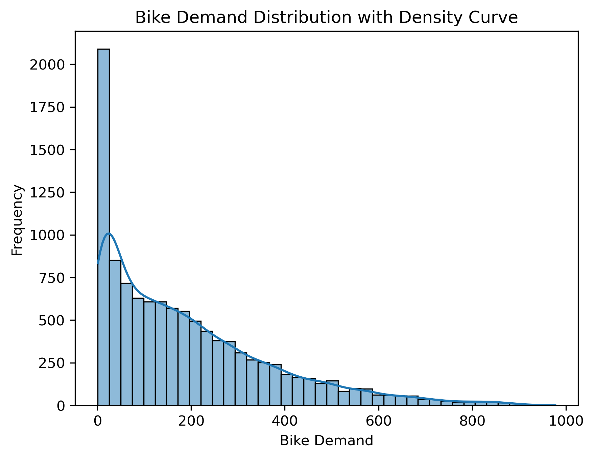
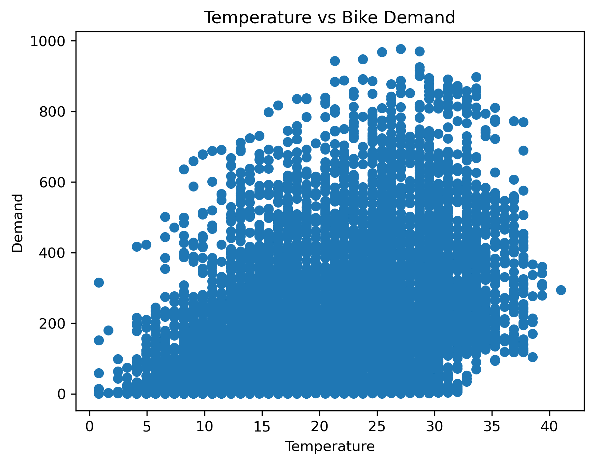
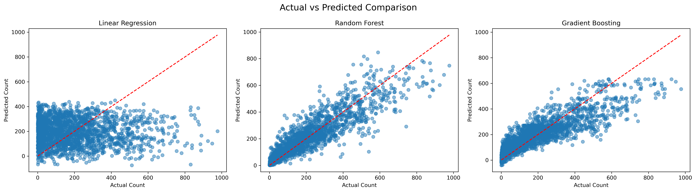
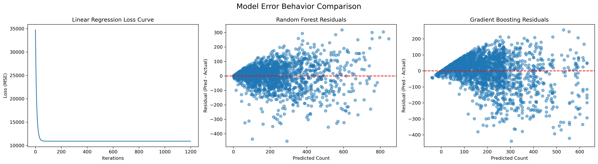
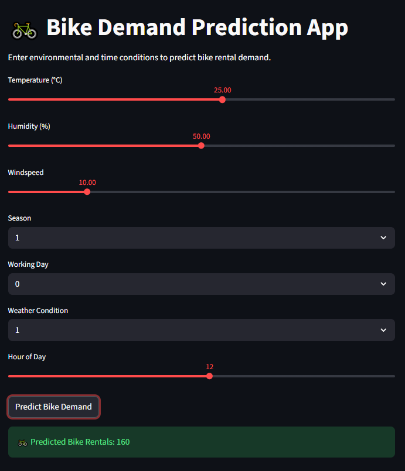

# 🚴 Bike Demand Prediction & Smart Forecasting App

An end-to-end **Machine Learning project** that predicts hourly bike rental demand using environmental and time-based factors, and deploys the best model as an interactive **Streamlit web application**.

This project demonstrates the full ML lifecycle — from **EDA and baseline modeling** to **advanced ensemble models and deployment**.

---

## 🎯 1. Key Objectives

The main goals of this project were to:

- 📈 Predict hourly bike rental demand  
- 🔍 Identify the most important factors influencing demand  
- ⚙️ Compare simple vs advanced machine learning models  
- 🌍 Build a real-world deployable prediction app  

This solution can help bike-sharing businesses with:

✔ Fleet allocation  
✔ Staff planning  
✔ Demand forecasting  
✔ Seasonal and weather-based strategy  

---

## Data Used: Bike Sharing Demand Dataset (Kaggle)

### Dataset Overview

  

---

## 📂 Project Structure
05_linear_regression_bike_sharing_demand/  
│  
├── data/  
│ ├── bike_sharing_demand.csv  
│  
├── images/  
│ ├── actual_vs_predicted_comparison.png    
│ ├── all_models_behaviour_comparison.png  
│ ├── dataset_overview.png  
│ ├── demand_distribution.png  
│ ├── hours_vs_demand.png  
│ ├── temp_vs_demand.png  
│ ├── webapp_screenshot.png   
│  
├── models/  
│ ├── bike_demand_rf_model.pkl  
│ ├── model_features.pkl 
│  
├── notebooks/  
├── linear_regression_bike_sharing_demand.ipynb  
│    
├── app.py  
└── README.md  

---

## 📊 Exploratory Data Analysis (EDA)

### 🔹 Demand Distribution

  

**Insight:**  
Demand is not uniform across hours — peak usage periods clearly exist, supporting the need for time-based modeling.  
Demand varies heavily by time, showing strong peak-hour behavior.

---

### 🔹 Temperature vs Demand

  

**Insight:**  
Demand generally increases with temperature, but the trend is noisy — meaning other factors also play a role.

---

## 🔄 3. Model Development Flow

The project intentionally progresses from **simple → advanced models** to demonstrate learning evolution.

---

### 🔹 Step 1: Linear Regression (Gradient Descent from Scratch)

Two versions were built:

| Model | Features | R² Score | Observation |
|------|----------|---------|-------------|
| Temp Only | Temperature | 0.15 | Too simple |
| Multi-Feature | Temp, Weather, Hour, etc. | 0.34 | Improved but still limited |

**Conclusion:**  
Linear models struggle because bike demand relationships are **non-linear**.

---

### 🔹 Step 2: Random Forest Regressor 🌳

- Handles non-linear relationships  
- Combines multiple decision trees  
- Reduces overfitting

**R² Score: 0.81** ✅  
Massive performance improvement.

---

### 🔹 Step 3: Gradient Boosting Regressor 🚀

- Learns sequentially from mistakes  
- Strong predictive power

**R² Score: 0.73**

--- 

## 📊 Model Comparison Visuals

### 🔹 Actual vs Predicted (All Models)

  

**Insight:**  
Random Forest predictions align closest to actual demand.

---

### 🔹 Error / Residual Behavior Comparison

  

**Insight:**  
Tree-based models show more stable and centered error patterns.

---

## 🏆 Final Model Selection

| Model | R² Score | Status |
|------|----------|--------|
| Linear Regression | 0.34 | Baseline |
| Gradient Boosting | 0.73 | Strong |
| **Random Forest** | **0.81** | ✅ Selected for Deployment |

Random Forest was chosen due to **highest accuracy and stability**.

---

## 🌐 Deployment — Streamlit Web App

An interactive web application was built where users can input:

- Temperature  
- Humidity  
- Windspeed  
- Season  
- Working day  
- Weather condition  
- Hour of day  

and receive **instant bike demand predictions**.

### App Preview

  

---

## 💡 Business Insights

| Finding | Business Value |
|---------|---------------|
| Demand peaks during commute hours | Optimize bike redistribution |
| Good weather increases rentals | Plan seasonal marketing |
| Weather strongly affects demand | Adjust inventory dynamically |
| Weekday vs weekend patterns differ | Use dynamic pricing strategies |
| ML model can forecast demand | Reduce shortages & idle bikes |

---

## 🛠 Tech Stack

- Python  
- pandas, numpy  
- matplotlib, seaborn  
- scikit-learn  
- Streamlit  
- Jupyter Notebook  

---

## 👤 Author

**Sitaram Dalvi**  
AI / ML Enthusiast | Project management professionsl  

---

## ⭐ Why This Project Stands Out

This project showcases:

✔ Full ML pipeline  
✔ Model comparison mindset  
✔ Feature engineering impact  
✔ Business interpretation of data  
✔ Real-world deployment  

It reflects how machine learning moves from **analysis → insight → application**.