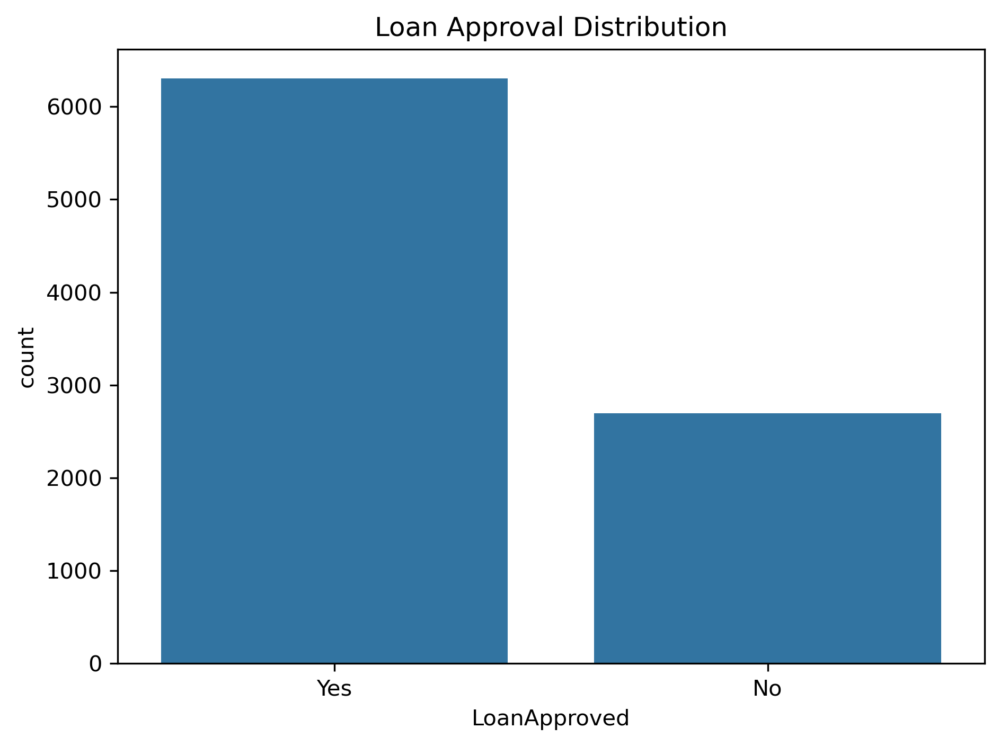
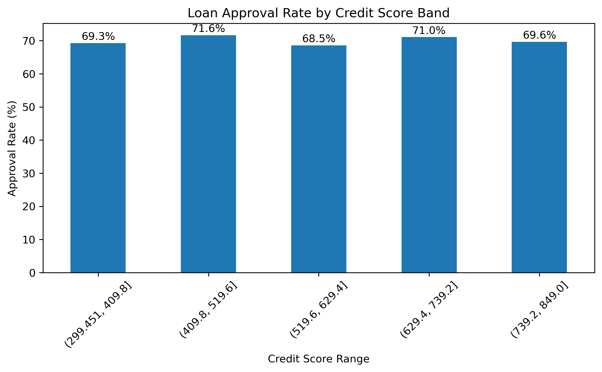
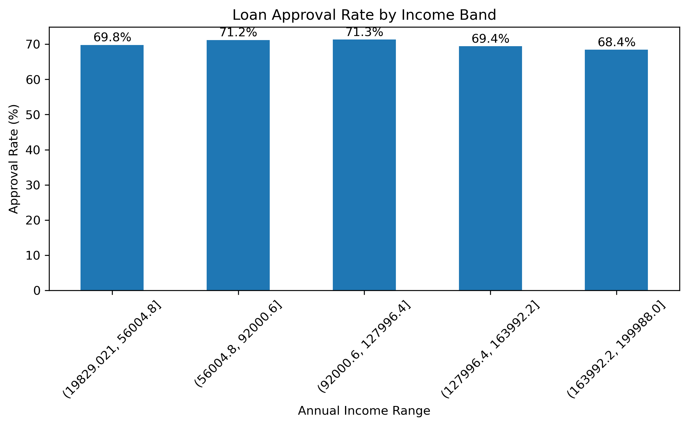
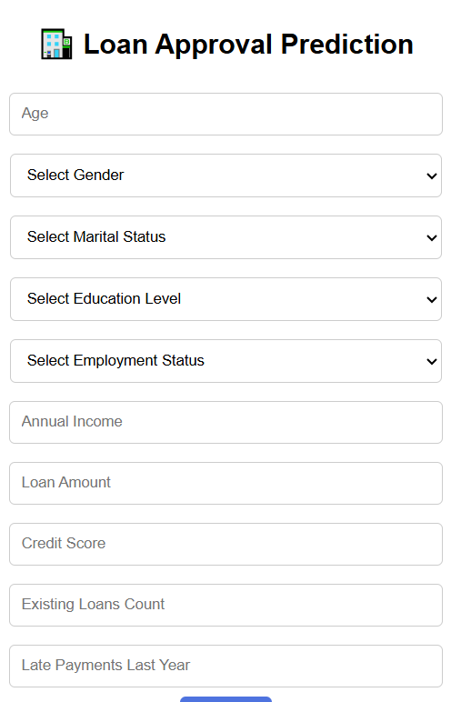

# 🏦 Loan Approval Prediction System (Decision Tree + Flask Web App)

## 📌 Project Overview

This project implements an **end-to-end Machine Learning system** to predict **loan approval outcomes** based on applicant demographic, financial, and credit-related attributes.

The project covers the **complete ML lifecycle**:
- Exploratory Data Analysis (EDA)
- Feature preprocessing and encoding
- Decision Tree model training
- Model evaluation
- Flask-based web application for real-time predictions

The goal is to demonstrate how a **business-interpretable ML model** can be deployed as a working web application.

---

## 🎯 Project Objectives

- Analyze historical loan data to understand approval patterns
- Identify key drivers influencing loan approval decisions
- Build an interpretable **Decision Tree classification model**
- Deploy the trained model using a **Flask web application**
- Ensure consistency between training and inference pipelines
- Provide a user-friendly interface for loan approval prediction

---

## 📂 Dataset Details

**Dataset Type:** Synthetic Loan Approval Dataset  
**Target Variable:** `LoanApproved` (Yes / No)

### Feature Summary

| Feature | Description |
|------|------------|
| Age | Applicant age |
| Gender | Male / Female |
| MaritalStatus | Single, Married, Divorced, Widowed |
| EducationLevel | Education qualification |
| EmploymentStatus | Employment category |
| AnnualIncome | Applicant annual income |
| LoanAmountRequested | Requested loan amount |
| CreditScore | Creditworthiness score |
| ExistingLoansCount | Number of active loans |
| LatePaymentsLastYear | Missed payments in last year |

---

## 📊 Exploratory Data Analysis (EDA)

EDA was performed to understand approval trends and feature relationships.

### 🔹 Loan Approval Distribution

  

**Key Insights:**
- Dataset shows **moderate class imbalance**
- Loan approvals occur more frequently than rejections
- Highlights the importance of evaluating metrics beyond accuracy

---

### 🔹 Loan Approval Rate by Credit Score Band

  

**Key Insights:**
- Approval rate increases with higher credit score bands
- Mid to high credit scores show consistently better approval chances
- Confirms **Credit Score as a strong decision factor**

---

### 🔹 Loan Approval Rate by Income Band

  

**Key Insights:**
- Middle income groups exhibit slightly higher approval rates
- Extremely high income does not guarantee approval
- Indicates income alone is insufficient — interaction with other features matters

---

## 🧠 Why Decision Tree Was Chosen

Based on EDA findings and business needs, **Decision Tree** was selected because:

- Handles **non-linear relationships** effectively
- Works well with **mixed feature types** (numeric + categorical)
- Requires **no feature scaling**
- Highly **interpretable** — ideal for financial decision-making
- Easy to explain approval / rejection logic to stakeholders

Decision Trees align well with real-world loan approval rules used by financial institutions.

---

## 🧪 Data Preprocessing

Steps applied:

- Label Encoding for categorical features
- Separation of features and target variable
- Preservation of **feature column order** to avoid inference mismatch
- Train-test split for evaluation

Artifacts saved for deployment:
- Trained Decision Tree model (`loan_approval_model.pkl`)
- Encoders for categorical variables (`encoders.pkl`)
- Feature column order (`features.pkl`)

---

## 🤖 Model Training & Evaluation

- Algorithm: **Decision Tree Classifier**
- Criterion: Gini Index
- Controlled depth to prevent overfitting

### Model Performance (Approx.)

| Metric | Value |
|------|------|
| Accuracy | ~70% |
| Strength | Interpretability & stability |
| Limitation | Sensitive to data distribution |

The accuracy aligns with dataset complexity and synthetic nature.

---

## 🌐 Web Application (Flask)

A Flask-based web app enables real-time loan approval prediction.

### Features:
- Dropdowns for categorical inputs (prevents invalid values)
- Numeric validation for financial inputs
- Consistent preprocessing between training and prediction
- Clear approval / rejection output

### Web App Screenshot

  

### Tech Stack:
- Flask
- HTML / CSS
- Python
- scikit-learn
- joblib

---

## 📁 Project Structure

06_decision_tree_loan_approval/  
│  
├── data/  
│ └── synthetic_loan_data.csv  
│  
├── images/  
│ ├── loan_approval_distribution.png  
│ ├── credit_score_approval_rate.png  
│ └── income_band_approval_rate.png  
│  
├── loan_approval_web_app/  
│ └── static/  
│   └── style.css  
│  
│ └── templates/  
│   └── index.html  
│  
│ ├── app.py  
│ ├── encoders.pkl  
│ ├── features.pkl  
│ └── loan_approval_model.pkl  
│  
│ └── notebooks/  
│   └── decision_tree_loan_approval_prediction.ipynb  
│  
└── README.md  

---

## ⚠️ Model Accuracy & Prediction Disclaimer

- The dataset used is **synthetic**, not real banking data
- Predictions are for **educational and demonstration purposes only**
- The web app **does not represent real loan approval systems**
- Actual financial decisions require regulatory checks and human validation

---

## 🙏 Acknowledgements

- This project was developed with the assistance of **ChatGPT** for:
  - Code review and debugging
  - ML pipeline consistency improvements
  - Feature order and deployment best practices
  - Documentation and README structuring

- All model outputs and predictions should be interpreted as **illustrative**, not authoritative.

---

## 👤 Author

**Sitaram Dalvi**  
AI / ML Enthusiast | PMP certified Project Manager  

