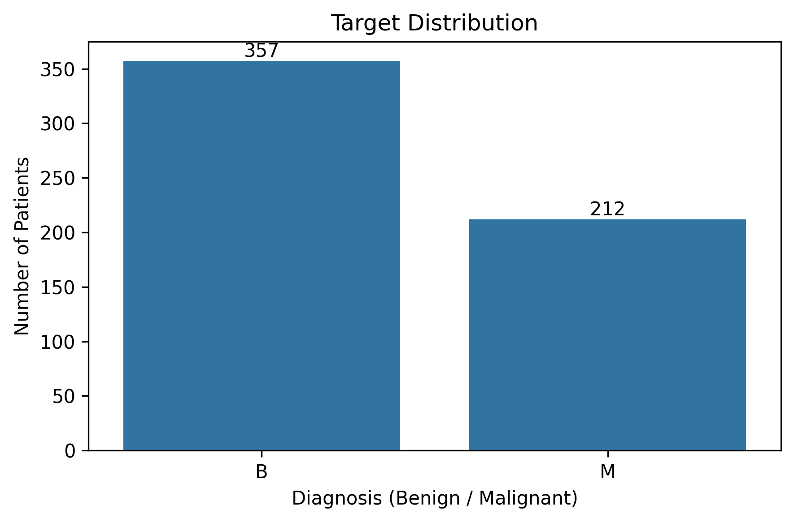
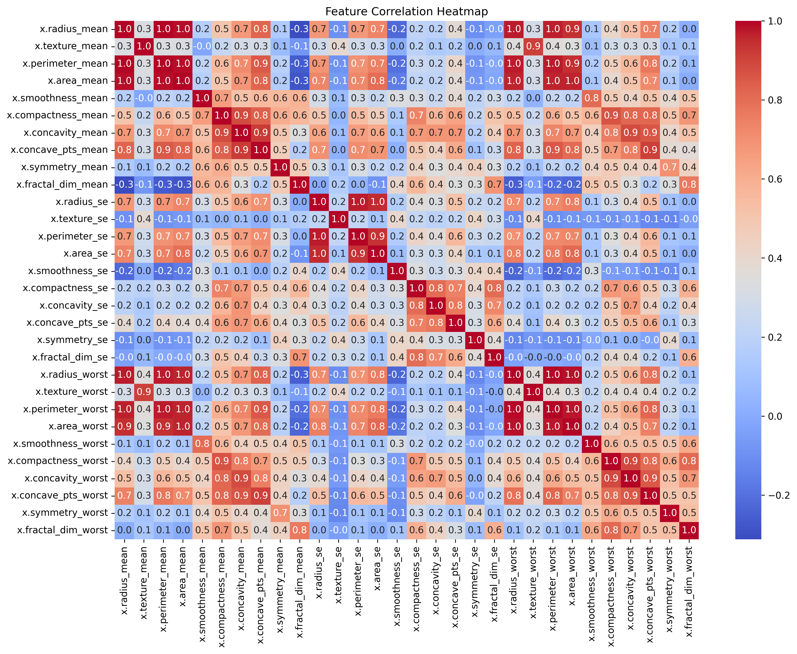

# 🧬 Breast Cancer Detection – K-Nearest Neighbors (KNN)
An end-to-end Machine Learning classification project that predicts whether a tumor is Benign or Malignant using medical diagnostic measurements.
This project demonstrates the complete ML workflow:  

Data Understanding → EDA → Preprocessing → Feature Scaling → Model Training → Model Evaluation → Medical Interpretation  

## 📌 Problem Statement
Early detection of breast cancer significantly increases survival rate.  
Doctors analyze multiple tumor measurements, but manually identifying patterns is difficult.  

The goal of this project is to:  

- Classify tumors as Benign (Non-Cancerous) or Malignant (Cancerous)
- Understand which features influence the diagnosis
- Build a reliable medical decision-support model
- Learn distance-based classification using KNN  

---

## 📊 Dataset Description

The dataset contains diagnostic measurements computed from digitized images of breast mass cell nuclei.  
|Feature Type|Example|
|-|-|
|Size Features|radius, perimeter, area|
|Texture Features|texture mean, smoothness|
|Shape Features|compactness, concavity, symmetry|
|Irregularity|fractal dimension|

Target Variable:  
y → Tumor Diagnosis  
- 0 → Benign
- 1 → Malignant

---

## 📂 Project Structure
07_KNN_breast_cancer_diagnostic/ 
│ 
├── data/ 
│   └── brca.csv 
│ 
├── images/ 
│   ├── target_distribution.png 
│   ├── correlation_heatmap.png 
│ 
├── notebook/ 
│   └── KNN_breast_cancer_diagnostic.ipynb 
│ 
└── README.md 

---

## 📊 Exploratory Data Analysis (EDA)

### 🔹 Target Distribution

  

**Insight:**  
Dataset is slightly imbalanced — benign cases are more frequent than malignant.  

---

### 🔹 Correlation Heatmap

  

**Insight:**  
Important observations:

- Radius, perimeter, and area are highly correlated
- Several features measure similar biological characteristics
- Indicates tumor size plays a major role in diagnosis

---

## 🧹 Data Preprocessing

Key preprocessing steps performed:

- Feature–target split
- Encoded target variable using LabelEncoder
- Train-test split (80% train, 20% test)
- Feature Scaling using StandardScaler (Very Important for KNN)

Why scaling?  
KNN uses distance calculation, and unscaled features dominate predictions.

---

## 🤖 Model Training – K-nearest neaighbors
KNN classifies a sample based on the majority label of its nearest neighbors.

The model works using:

“A tumor is classified based on similarity with nearby tumors.”

Distance metric used: Euclidean Distance

---

## 📈 Model Evaluation & Diagnostics

#### Performance Results
- Accuracy ≈ 93%
- Weighted F1 Score ≈ 0.93

#### 🔎 Classification Report Insights

- Benign Recall = 0.99 → Almost all benign tumors correctly detected
- Malignant Precision = 0.97 → When model predicts cancer, it is usually correct
- Malignant Recall = 0.84 → Some cancer cases missed

⚠️ Important: In medical problems, recall of malignant class is more important than accuracy.

---

## 🧠 Key Learnings

- KNN is sensitive to feature scaling
- Distance-based models depend on feature magnitude
- Medical datasets require recall-focused evaluation
- Highly correlated features indicate biological relationships
- Accuracy alone is not sufficient for healthcare ML

---

## 🛠️ Tools & Technologies
- **Python**
- **pandas, numpy**
- **matplotlib, seaborn**
- **scikit-learn**
- **Jupyter Notebook**

---

## 👤 Author
**Sitaram Dalvi**  
AI / ML Enthusiast | Project Management Professional

