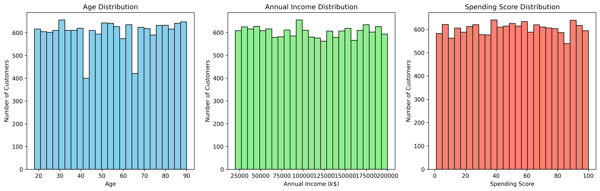
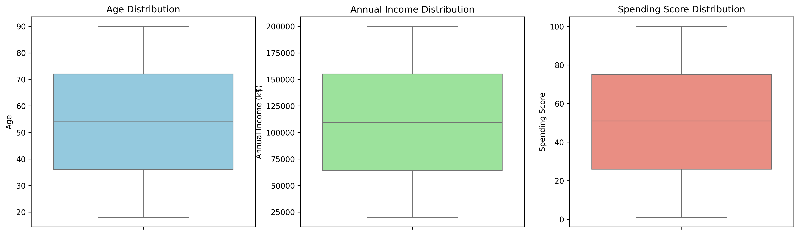
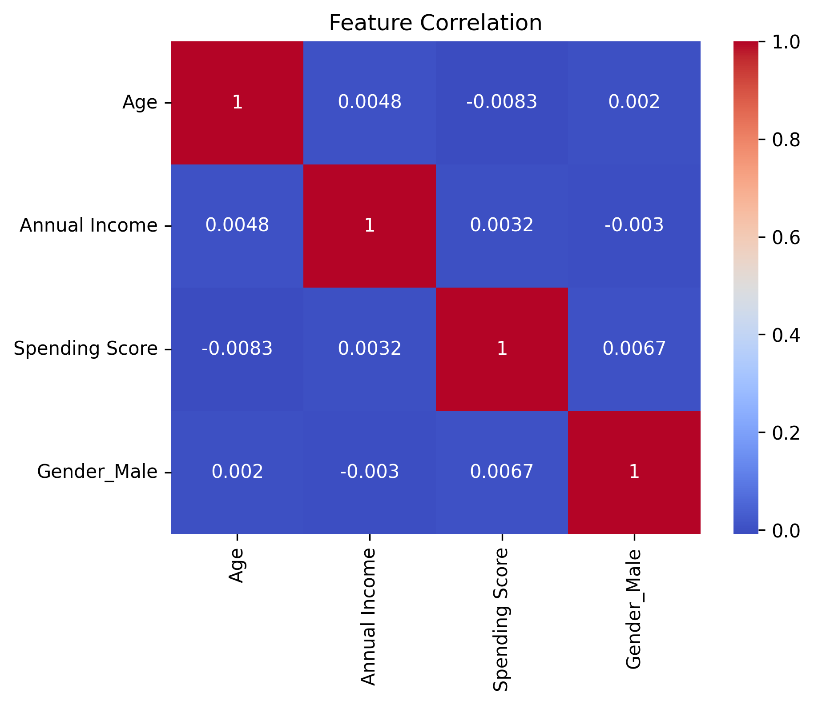
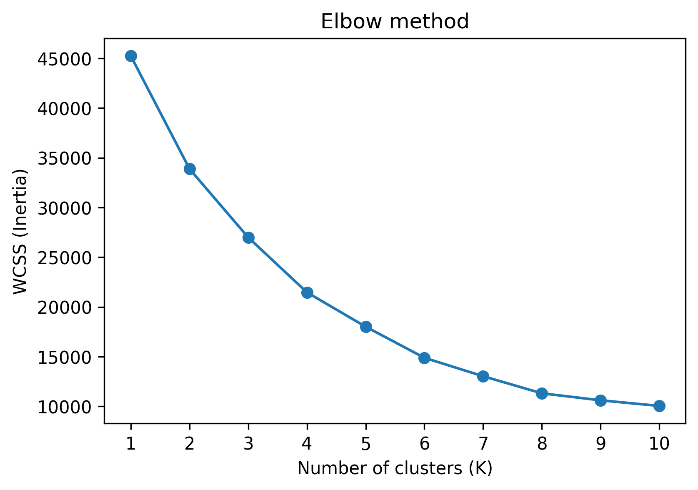
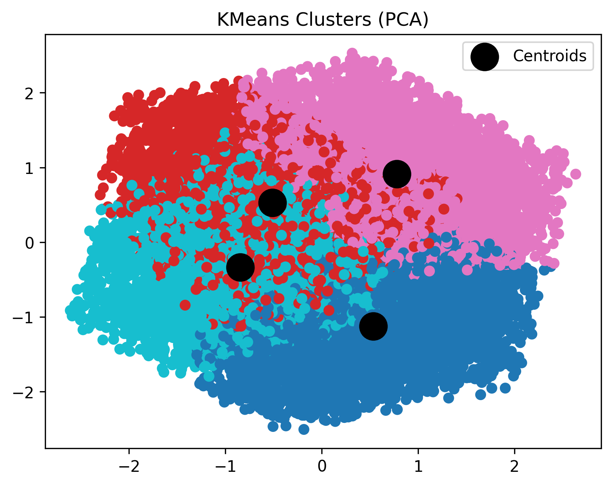

# 🛍️ Customer Segmentation using K-Means Clustering
An end-to-end Unsupervised Machine Learning project that groups mall customers into meaningful segments based on their shopping behavior using the K-Means clustering algorithm.  

This project demonstrates a complete clustering workflow:  
EDA → Data Preprocessing → Feature Scaling → Optimal K Selection → K-Means Training → PCA Visualization → Cluster Profiling → Business Insights   

## 📌 Problem Statement
Retail businesses have many customers, but **all customers do not behave the same way.**  

The goal of this project is to:  
- Identify different types of customers automatically
- Understand spending behavior patterns
- Help businesses target the right customers
- Support personalized marketing strategies

Instead of one common marketing plan, businesses can create **segment-specific campaigns.**

---

## 📊 Dataset Description

The dataset contains shopping details of mall customers.  

Each record represents one customer.  

|Column	|Description|
|-|-|
|Customer ID	|Unique customer identifier|
|Gender	|Male / Female|
|Age	|Customer age|
|Annual Income |Yearly income|
|Spending Score |Shopping behavior score assigned by mall|

---

## 📂 Project Structure
09_K_mean_clustering_mall_customer_segmentation/  
│  
├── data/  
│ └── shopping_mall_customer_data.csv  
│  
├── notebook/  
│ └── K_mean_clustering_mall_customer.ipynb  
│  
├── images/  
│ ├── feature_distribution.png  
│ ├── box_plots.png  
│ ├── correlation_heatmap.png  
│ ├── ELBOW_method.png  
│ └── cluster_plot.png  
│  
└── README.md  

---

## 🔎 Exploratory data analysis

#### Feature distribution

  

#### Box plots

  

#### Correlation heatmap

  

---

## 🧹 Data Preprocessing

**1. Handling Unnecessary Columns** - Customer ID removed because it does not affect behavior.  
**2. Encoding Categorical Feature** - Gender converted using One-Hot Encoding.  
**3. Feature Scaling (Very Important)** - K-Means uses distance calculations, so scaling is required.  

StandardScaler was applied so all features contribute equally.  

---

## 📐 Finding Optimal Number of Clusters

Two methods were used:
**Elbow Method**  
- Measures Within Cluster Sum of Squares (WCSS).  
- The bend in the curve indicates optimal cluster count.  
  
**Silhouette Score**  
Measures how well data points fit within their cluster.  

### Elblow plot

  

Final Selected:
K = 4 Clusters

---

## 🤖 Model Training — K-Means Clustering

K-Means algorithm groups customers by minimizing distance between data points and cluster centers (centroids).

Working:
- Initialize K centroids
- Assign customers to nearest centroid
- Recalculate centroid
- Repeat until convergence

Output: Each customer assigned to a segment (Cluster 0–3)

---

## 📉 PCA Visualization

Since the dataset has multiple features, Principal Component Analysis (PCA) was used to reduce dimensions to 2D for visualization.  

#### Cluster plot

  

Why PCA?  

Humans cannot visualize 4-dimensional data. PCA projects high-dimensional customer data into 2D while preserving maximum information. Black circles represent cluster centroids (average customer of each segment).  

---

## 👥 Cluster Profiling (Customer Segments)

The model discovered four customer types:

**1. Premium Customers**  
High income & high spending

**2. Careful Rich Customers**  
High income & low spending

**3. Impulsive Buyers**  
Low income & high spending

**4. Budget Customers**  
Low income & low spending  

---

## 🧠 Key Learnings

- Customers are naturally divided into distinct behavioral groups
- Spending behavior is not dependent on income alone
- Some low-income customers spend more frequently
- High-income customers are not always high spenders
- Segment-based marketing will be more effective than general marketing

---

## 🛠️ Tools & Technologies
- **Python**
- **pandas, numpy**
- **matplotlib, seaborn**
- **scikit-learn**
- **K-Means Clustering** 
- **PCA**
- **Jupyter Notebook**

---

## 👤 Author
**Sitaram Dalvi**  
AI / ML Enthusiast | Project Management Professional

