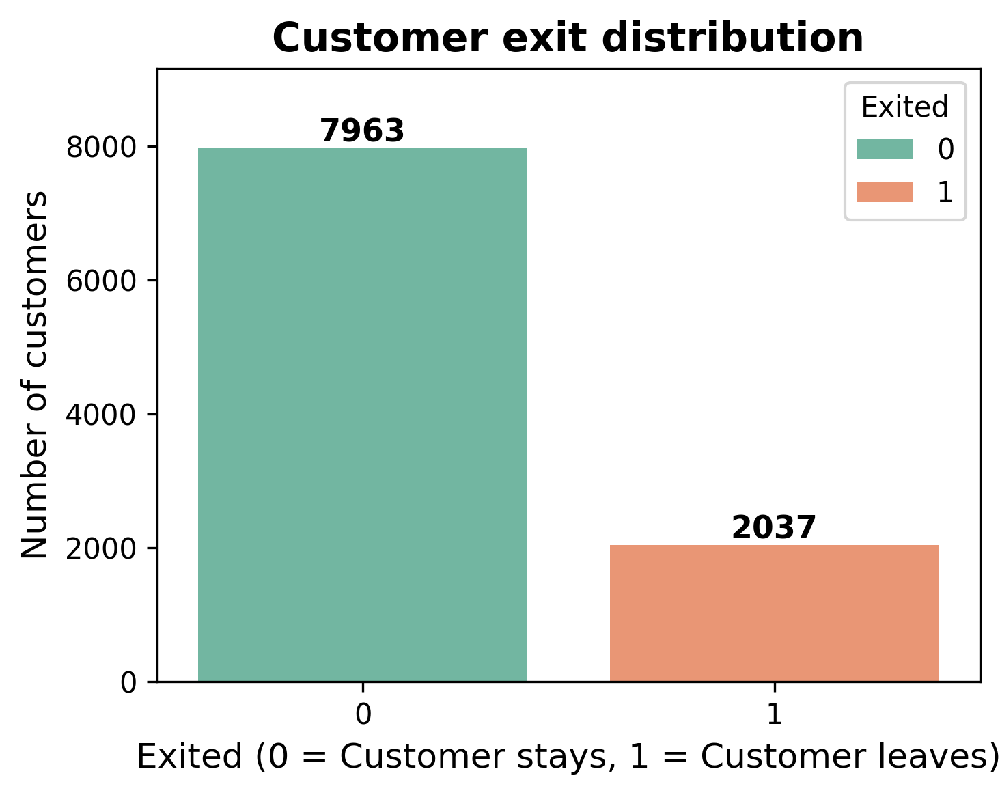
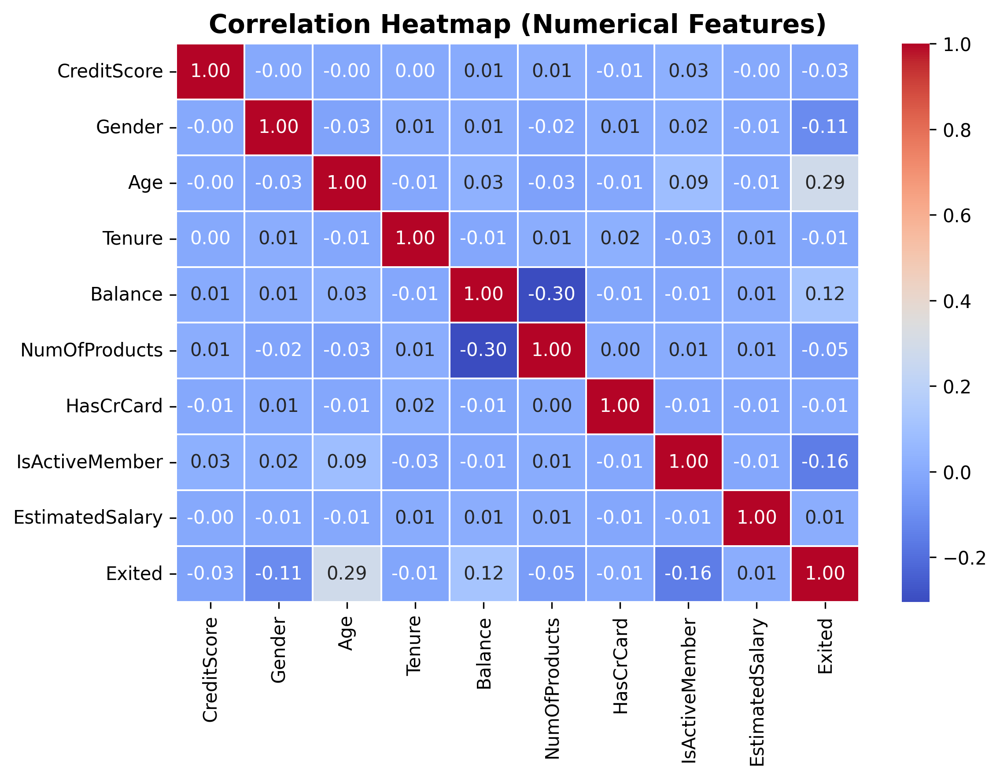
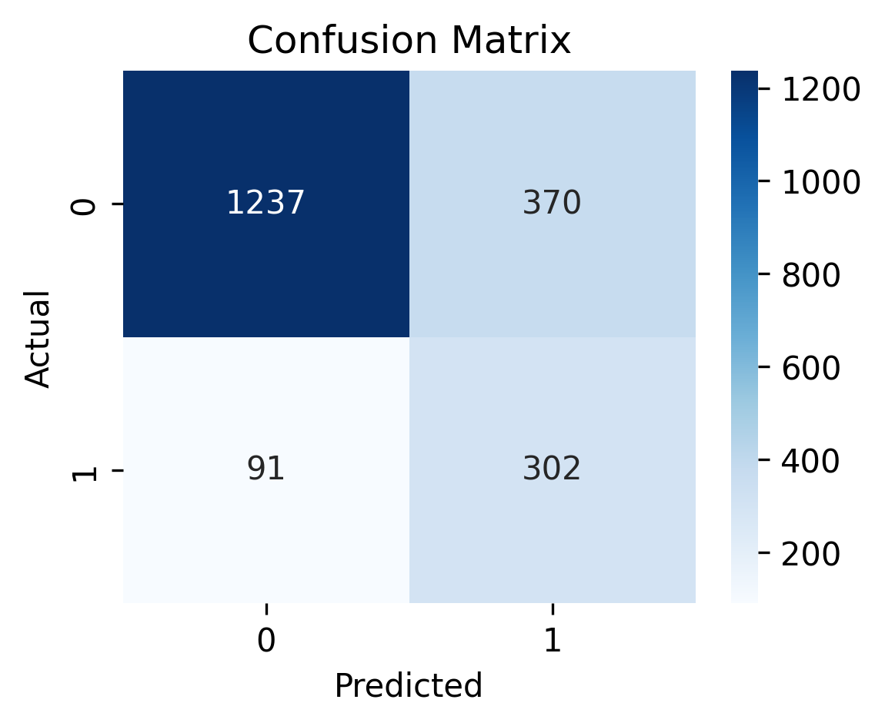
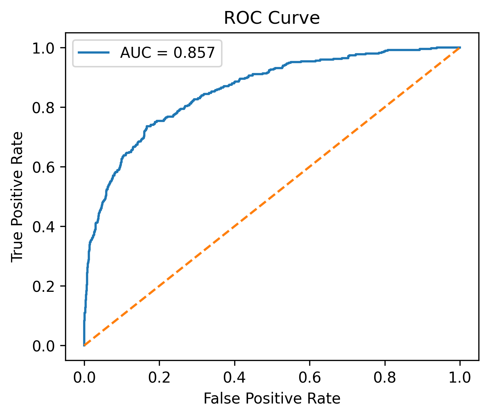

# 🏦 Bank Customer Churn Prediction using Artificial Neural Network (ANN)
An end-to-end Supervised Machine Learning (Deep Learning) project that predicts whether a bank customer will leave the bank (churn) using an Artificial Neural Network.

This project demonstrates a complete ML workflow:
EDA → Data Preprocessing → Feature Engineering → Class Imbalance Handling → ANN Training → Threshold Tuning → Model Evaluation → Business Insights   

## 📌 Problem Statement
Banks lose significant revenue when customers close their accounts. However, it is difficult to manually identify customers who are about to leave.

The goal of this project is to:

- Predict customers likely to churn
- Identify behavioral patterns behind customer exit
- Help the bank take preventive retention actions
- Support targeted marketing and retention campaigns

Instead of reacting after customers leave, the bank can **proactively retain high-risk customers**.

---

## 📊 Dataset Description

Each row represents one bank customer.

|Column	|Description|  
|-|-|  
|CreditScore	|Customer credit score|  
|Geography	|Country of customer|  
|Gender	|Male / Female|  
|Age	|Customer age|  
|Tenure	|Years with bank|  
|Balance	|Account balance|  
|NumOfProducts	N|umber of bank products used|  
|HasCrCard	|Has credit card (1/0)|  
|IsActiveMember	|Active account user (1/0)|  
|EstimatedSalary	|Estimated salary|  
|Exited	|Target variable (1 = Churn, 0 = Stay)|  

Dataset size: **10,000 customers**

---

## 📂 Project Structure
10_ANN_bank_customer_churn/  
│  
├── data/  
│ └── bank_customer_churn.csv   
│  
├── notebook/  
│ └── ANN_bank_customer_churn.ipynb    
│  
├── images/  
│ ├── confusion_matrix.png   
│ ├── correlation_heatmap.png  
│ ├── customer_exit_distribution.png  
│ └── ROC_AUC_curve.png  
│  
└── README.md  

---

## 🔎 Exploratory data analysis

#### Target distribution

  

Insight: 
~80% customers stay, ~20% customers churn → imbalanced dataset.  

#### Correlation heatmap

  

Key observations: 
- Age has strongest positive relation with churn 
- Active membership reduces churn 
- Balance moderately influences churn 
- Credit score and salary show weak impact 

---

## 🧹 Data Preprocessing

**1. Dropped Irrelevant Columns**  
RowNumber, CustomerId, Surname removed

**2. Encoding Categorical Features**  
- Gender → Label Encoding  
- Geography → One-Hot Encoding  

**3. Feature Scaling**  
StandardScaler applied (very important for ANN)  

**4. Handling Class Imbalance**  
Used class_weight instead of SMOTE to avoid unrealistic synthetic customers.  

**StandardScaler** was applied so all features contribute equally.  

---

## 🤖 Model - Artificial Neural Network

Architecture:
- **Input Layer**
  - Dense (128 neurons, ReLU)
  - Dropout (0.4)
  - Dense (64 neurons, ReLU)
  - Dropout (0.3)
  - Dense (32 neurons, ReLU)
- **Output Layer:** Sigmoid

**Loss Function:** Binary Crossentropy  
**Optimizer:** Adam (learning_rate = 0.0005)  
**EarlyStopping** used to prevent overfitting  

**⚙️ Threshold Tuning**

Default classification threshold 0.5 was not optimal for imbalanced data.  

The decision boundary was tuned to 0.45.  

This improved the balance between detecting churn customers and avoiding excessive false alarms.  
 
---

## 📈 Model Evaluation

#### Confusion Matrix

  

#### ROC Curve

  

**AUC Score: 0.857** → Strong separation capability

#### 📊 Final Model Performance
|Metric	|Value|
|-|-|
|Accuracy	|0.77|
|Churn Recall	|0.77|
|Churn Precision	|0.45|
|F1-Score	|0.57|
|ROC-AUC	|0.857|

---

## 🧠 Key Insights

#### Primary churn drivers

- Older customers are more likely to leave
- Inactive members show high churn probability
- Customers with fewer bank products churn more
- Higher balance customers show exit tendency

#### Weak predictors

- Credit score has little effect on churn
- Salary does not influence retention
- Having a credit card does not guarantee loyalty
- Tenure alone cannot ensure retention

#### Behavioral insight  

- Churn is driven mainly by engagement and product usage, not financial strength.  

---

## 🏁 Conclusion

The Artificial Neural Network successfully learns complex customer behavior patterns and can identify potential churn customers with good recall and strong AUC performance. Although some false positives exist, this is acceptable in retention systems because contacting an extra customer is less costly than losing a real one.  

#### Business Takeaway:
Customer churn is primarily an engagement problem rather than a credit or income problem. Banks should focus on activating inactive customers, improving product usage, and offering personalized retention plans to at-risk customers.  

---

## 🛠️ Tools & Technologies
- **Python**
- **pandas, numpy**
- **matplotlib, seaborn**
- **scikit-learn**
- **TensorFlow / Keras** 
- **Artificial Neural Network (Deep Learning)**
- **Jupyter Notebook**

---

## 👤 Author
**Sitaram Dalvi**  
AI / ML Enthusiast | Project Management Professional

